# ECE 16 Lab 3 report 
By: Anwar Hsu A15443752

Date: 01/30/2020

## Tutorial: 

### Tutorial Python Basics Tutorial:

> Q. Show the code - Starting with a = “Hello World!!!”, come up with a code that will give us b = “Hello” and c = “World” and d = “!!!” . Also, in code, check if “ello” is in a. 

> A. Image of code:  
> 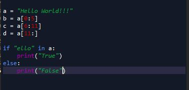
> Image of variable output:
> 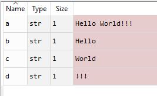
> Check if ello is in string a 
> 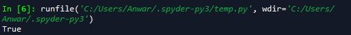

> Q. In the following code, what is the output of the print statement? Why doesn’t original_list = ['hi','how','are','you']?

> A. The print statements prints the orignial_list where there is no changes. This is because there arent any pieces of cod where we are changing this oringial list. In the second line new_list creates a copy and the rest of the code affects that copy, yet the original_list hasnt been changed.  
>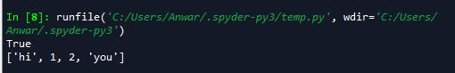

### Tutorial 2: Pyserial, Numpy

> Q. Try sending without the .encode. What happens? 

> A. It gives me the error "TypeError: 'str' object is not callable" This is caused because it returns a int. So if we input a string it gives us an error. If we convert the string to encoded, it gives us a the type bytes. 

> Q. Identify in the above code, (1) which python command prints to the python’s own console, and (2) which python command prints to the serial port to the MCU?

> A. 1) The

### Receiving Data with Python:

> Q. Describe the output you observe on the Python side? 

> A. it outputs the time that the addtimer function is suppose to print to the serial monitor in ardiuno. 

> Q. Change the code to read 10 bytes instead of 30. Now what do you get? What are the 10 bytes you received? Remove decode might help you understand

> A. 

### Receiving A Byte at a Time 

> Q. Describe the output you observe on the Python side? Is it the same as before? What does this tell you about the print() function of python? 

> A. the Try keyword is lowercase t. so its try:

### Numpy

Numpy Array:
> Q. Show the code - Make an Numpy Array called test_array  from a list = [0,10,4,12]. Subtract 20 from the test_array, what do you get? What is the shape of the test_array

> A.
> 
>CODE:
> 
>  
> OUTPUT:
> 

> Q. Show the code - Make a 2D array of test_2D_array from [0,10,4,12][1,20,3,41]

> A.
> 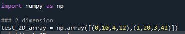

Zeros and Ones:
> Q. Make a 2D array of zeros with shape of 10x20 and then print it out

> A.
> 
> CODE:
> 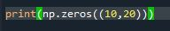
>  
> OUTPUT:
> 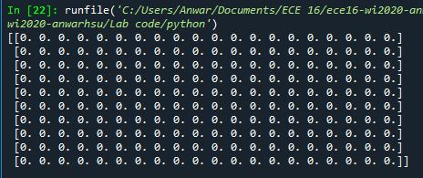

hstack and vstack:
> Q. Show the code - Out of the test_array, create the following using hstack and vstack.

> A.
> 
> CODE:
> 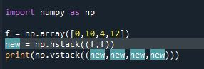
>  
> OUTPUT:
> 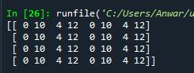

arange:
> Q. Show the code - Using arange, make an array called arange_array1 to equal [-3, 3,9,15] and arange_array2 to equal [ -7,  -9, -11, -13, -15, -17, -19]

> A.
> 
> CODE:
> 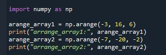
>  
> OUTPUT:
> 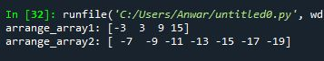