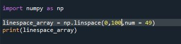
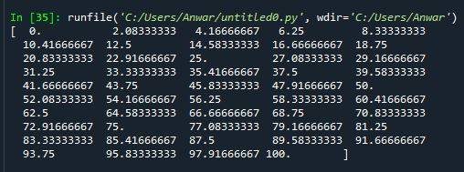
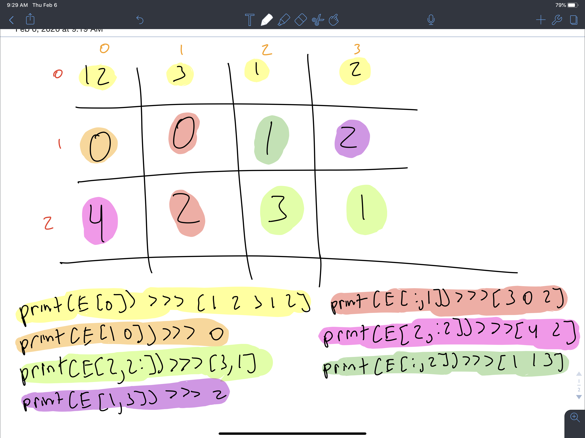
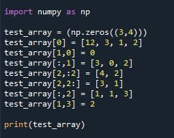
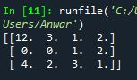
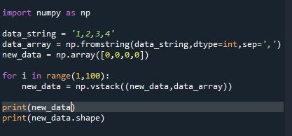
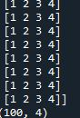
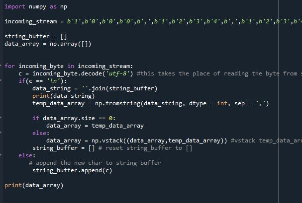
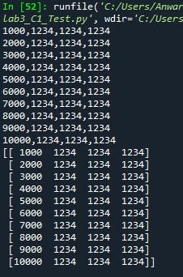

# ECE 16 Lab 3 report 
By: Anwar Hsu A15443752

Date: 01/30/2020

## Tutorial: 

### Tutorial Python Basics Tutorial:

> Q. Show the code - Starting with a = “Hello World!!!”, come up with a code that will give us b = “Hello” and c = “World” and d = “!!!” . Also, in code, check if “ello” is in a. 

> A. Image of code:  
> 
> Image of variable output:
> 
> Check if ello is in string a 
> 

> Q. In the following code, what is the output of the print statement? Why doesn’t original_list = ['hi','how','are','you']?

> A. The print statements prints the orignial_list where there is no changes. This is because there arent any pieces of cod where we are changing this oringial list. In the second line new_list creates a copy and the rest of the code affects that copy, yet the original_list hasnt been changed.  
>

### Tutorial 2: Pyserial, Numpy

> Q. Try sending without the .encode. What happens? 

> A. It gives me the error "TypeError: 'str' object is not callable" This is caused because it returns a int. So if we input a string it gives us an error. If we convert the string to encoded, it gives us a the type bytes. 

> Q. Identify in the above code, (1) which python command prints to the python’s own console, and (2) which python command prints to the serial port to the MCU?

> A. 1) print() function prints python to its own console. 2) ser.write(S.encode('utf-8'))  prints to the MCU serial port. 

> Q. What happens if you take out the \n in the string? Why?

> A. Its not going to get outputed. In the receiveMessage function in Ardiuno, it outprints the message onto the OLED once the '\n' character has been read. If we take out this '\n' character it will keep adding the the in_text_index variable until a new line has been meet. 

### Tutorial 2: Receiving Data with Python:

> Q. Describe the output you observe on the Python side? 

> A. it outputs the time that the addtimer function is suppose to print to the serial monitor in ardiuno. 

> Q. Change the code to read 10 bytes instead of 30. Now what do you get? What are the 10 bytes you received? Remove decode might help you understand

> A. 

### Tutorial 2: Receiving A Byte at a Time 

> Q. Describe the output you observe on the Python side? Is it the same as before? What does this tell you about the print() function of python? 

> A. the Try keyword is lowercase t. so its try:

### Tutorial 2: Numpy

Numpy Array:
> Q. Show the code - Make an Numpy Array called test_array  from a list = [0,10,4,12]. Subtract 20 from the test_array, what do you get? What is the shape of the test_array

> A.
> 
>CODE:
> 
>  
> OUTPUT:
> 

> Q. Show the code - Make a 2D array of test_2D_array from [0,10,4,12][1,20,3,41]

> A.
> 

Zeros and Ones:
> Q. Make a 2D array of zeros with shape of 10x20 and then print it out

> A.
> 
> CODE:
> 
>  
> OUTPUT:
> 

hstack and vstack:
> Q. Show the code - Out of the test_array, create the following using hstack and vstack.

> A.
> 
> CODE:
> 
>  
> OUTPUT:
> 

arange:
> Q. Show the code - Using arange, make an array called arange_array1 to equal [-3, 3,9,15] and arange_array2 to equal [ -7,  -9, -11, -13, -15, -17, -19]

> A.
> 
> CODE:
> 
>  
> OUTPUT:
> 

linspace:
> Q. Make an array call linspace_array using linspace that goes from 0 to 100 with 49 steps. 

> A.
> 
> CODE:
> 
>  
> OUTPUT:
> 

> Q. How does linspace and arange differ? When might you use one over the other?

> A. The linepsace will increment based on how many step sizes you want. It will evenly divide the start and end values by how many step sizes and even use floating point accuracy. While if we use arrange. We are in control by how much we increment each step from start to finish. The benfit to using the linspace would if you don't know the divisional increments while the arrange is good if you do know how much your incremnts are going to be. 

Indexing and slicing
> Q. What is an array of size 3x4 that would produce the following results. Show your work on how you deduced your answer on paper or some kind of graphics :

> A. 
>
> 

> Q. Show your code - Now solve the above indexing and slicing problem by writing the code using array assignment. 

> A.
> 
> CODE:
> 
>  
> OUTPUT:
> 

> Q. Using fromstring, vstack, and a for loop, create an array of 100x4 from s: [[1,2,3,4],[1,2,3,4],[1,2,3,4]…..[1,2,3,4]]. 

> A.
> 
> CODE:
> 
>  
> OUTPUT: I didn't include the 100 repeating array of [1,2,3,4] because it wouldn't fit. I just outputed the dimensions of the aray at the bottom whihc is 100x4
> 

## Challenges 

### Challenge 1: Setting Your Watch to Send Data

### Challenge 2: Reading Accelerometer Data

> 
>

> Q. What happens if you don’t decode the incoming char?

> A. The code cant read the incoming chars 

> Q. Try removing the logic for checking if the data_array is empty and always vstack even if the data_array is empty. What is the error that gets thrown? Why?

> A. 

> Q. Try removing the 1 second delay on the MCU when starting data sending. Describe what happens?

> A. 

