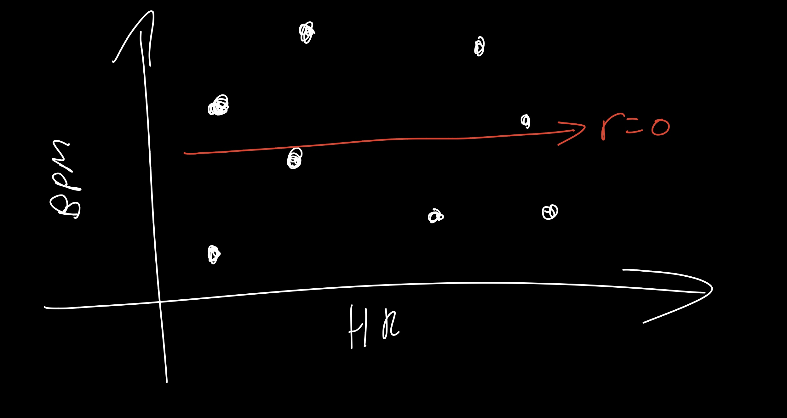
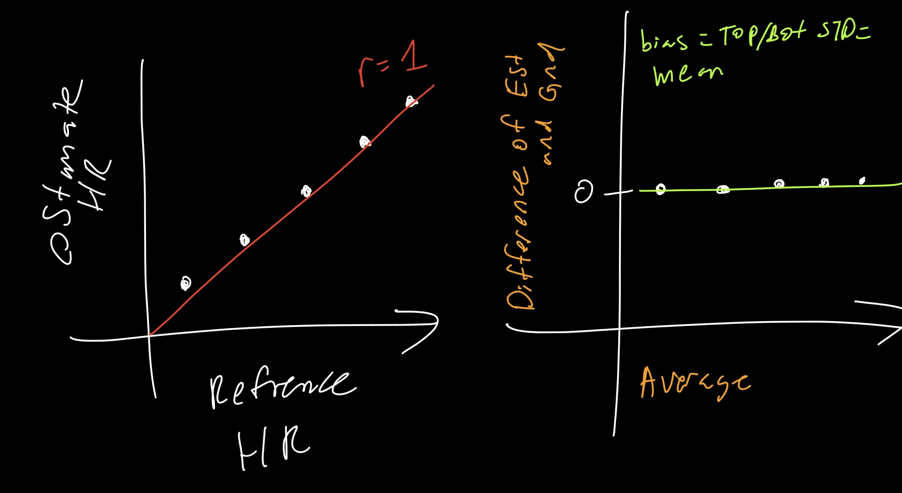

# ECE 16 Lab 5 report 
By: Anwar Hsu A15443752

Date: 02/29/2020

## Tutorial 

### Tutorial Correlation and Bland-Altman Plot :
> Q. Which metric (R,RMSE,STD,Bias) do you use to look at each of the four key analysis?

> A. Accuracy = RMSE, Precision = STD, Bias = Bias, Correlation = R 
>
> 

> Q. Using the above code, plot the correlation and bland-altman plot of your lab 4 HR estimation vs the reference. What is your R value, bias, and 95% limits of agreement

> A. R value is .33, Bias = 2, top STD = 30.15, bottom STD = 0.3

> Q. Sketch the correlation plot that would give you an R of 0. What does an R of 0 mean?

> A. 

> Q. Sketch a scatter plot of the correlation and bland-altman plot if your estimation was perfect every time. What would be the R, RMSE, Bias, and STD value of a perfect estimator?

> A. 

> Q. How might we use the 1.96STD mark to assess if a given estimate might be an outlier?

> A. If the points are outside the range of the top/ bottom STD range. In my graph we can we theres three points below the green line(bottom STD).

> Q. What would your Bland-Altman plot look like if your algorithm always guessed 70BPM regardless of the actual heart rate? Describe some prominent features about the graph beyond just showing it. 

> A. the points near 70 BPM will more likey fall in the BPM range(depends on what reference HR range you have). The points in the correlation graph would also we a horizontal line at the y axis of 70. So the further the reference the more likey its going to be an outlier. 

### Tutorial Frequency Domain:

> Q. If your sampling rate was 120Hz, what would be your maximum frequency (the Nyquist frequency)?

> A. 60 because 1/2 of the sampling frequency(120hz) = 60hz(Nyquist frequency)

> Q. If your signal bandwidth is composed of 0-10Hz, what is your minimum sampling rate to capture this signal based on the Nyquist sampling theorem? What would be recommended in general practice however?

> A. In theory our minimum sampling rate would be 20Hz(2times the sampling rate). However, in pratice, the we doint have perfect ideal filters in the real world, thus causing noise so its best to sample 4 times the sampling rate which would be 40hz. 

### Tutorial Baseline DC Signal:

> Q. How does your detrend function modify the frequency content of the signal? Show the plot and circle the part that is most modified and explain why.

> A. 
> 

### Dominant Frequency Component:

> Q. Show the code - Use np.argmax to find the actual dominant frequency of the x acceleration (currently labeled as 1Hz in the above plot). The aim here is to use argmax to get the index of the maximum value of Pxx and then use that index to get the corresponding frequency in the Freqs array. Try this with and without removing the DC offset. What do you get?

